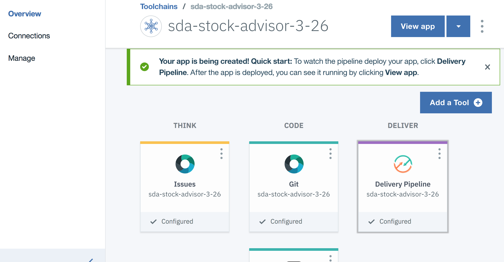
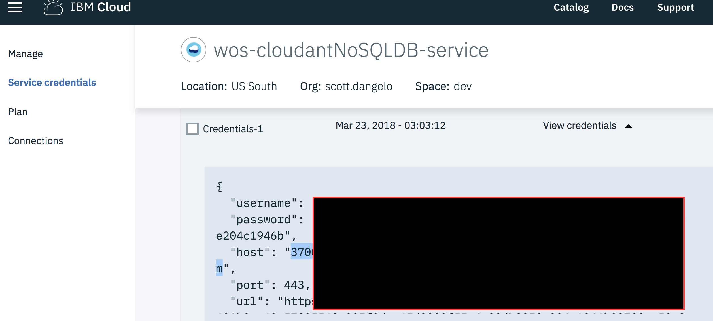
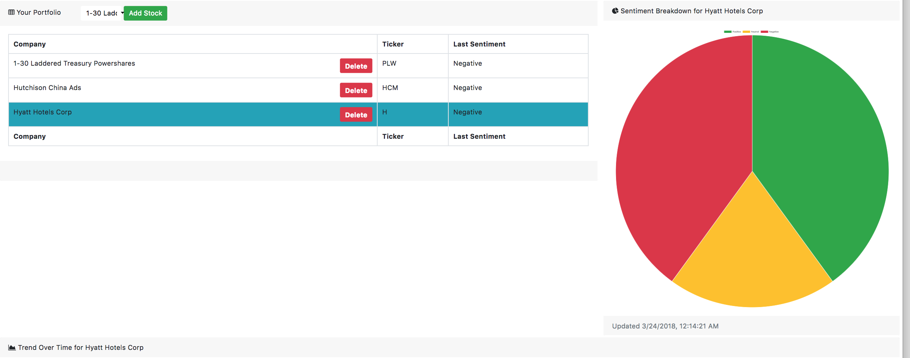
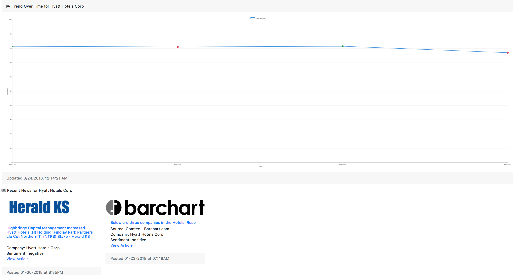

[](https://travis-ci.org/IBM/watson-stock-advisor)

*Read this in other languages: [英語](README.md)*

# Watson Stock Advisor

このコードパターンでは、Watson Discovery、Node.js、Cloudant NoSQL DB、 Alpha Vantageを利用して、リストされた企業のセンチメント、株価、ニュースをモニタリングするWebアプリケーションを作成します。このWebページは [Start Bootstrap](https://startbootstrap.com/ "Start Bootstrap") から [Blackrock Digital](https://github.com/BlackrockDigital "Blackrock Digital") が提供している [テンプレート](https://startbootstrap.com/template-overviews/sb-admin/ "Start Boostrap SB Admin") を利用しています。[License](https://github.com/BlackrockDigital/startbootstrap-sb-admin/blob/master/LICENSE "SB Admin License") を含んだテンプレートは [こちら](https://github.com/BlackrockDigital/startbootstrap-sb-admin "SB Admin Repo") にあります。

このコード・パターンをひと通り完了すると、以下の方法がわかるようになります:

* Discovery と Cloudant NoSQL Database の作成と利用
* Watson Discovery News service からニュースの収集
* Alpha Vantageから株価情報の取得
* 企業情報の選択入力と情報を表示するNodejsアプリケーションのデプロイ


<p align="center">
  
</p>

## Flow

1. Web UI を使用して株式を追加および削除します。
2. アプリが入力を処理してバックエンド・サーバーにルーティングします。
3. バックエンド・サーバーが株式情報を Cloudant NoSQL データベース内に保管します。
4. バックエンド・サーバーは Watson Discovery を利用して、特定の企業に関する情報を見つけます。
5. Watson Discovery は Watson News Collection に対してクエリーを実行し、企業に関連するニュース記事を検出します。
6. 特定の企業の市場価格を調べるために、Alpha Vantage API に対するクエリーが実行されます。
7. Web アプリにニュース、センチメント、株価が返されて、そのすべてがレンダリングされます。

## 含まれるコンポーネント

* [Watson Discovery](https://www.ibm.com/watson/developercloud/discovery.html): アプリケーションにパターン、傾向、アクションにつなげることのできる洞察を認識させるコグニティブ検索とコンテンツ分析エンジン。
* [Cloudant NoSQL DB](https://console.ng.bluemix.net/catalog/services/cloudant-nosql-db): フレキシブルなJSONスキーマを活用するモダンWebとモバイルアプリケーションのための管理不要のフル・マネージド型の データベースサービス

## 注目のテクノロジー

* [NodeJS](https://nodejs.org/en/): Node.js® は8 JavaScript エンジン で動作する JavaScript 環境です。 Node.js は、軽量で効率的に動作する非同期型のイベント駆動モデルを採用しています。Node.js のパッケージ管理マネージャである npm は、世界で最も大きなオープンソースのライブラリエコシステムです。

# 解説動画

[](https://www.youtube.com/watch?v=Z2JFlQpYmSY)

# 前提条件

### Alpha Vantageのアカウント作成とAPIキーの取得

* `Get Your Free API Key Today`をクリックして[Alpha Vantage](https://www.alphavantage.co/)のアカウントを作成してください。
* Alpha Vantage APIキーを後で使用するので、コピーしておいてください。

* (日本語訳注: この他に以下が必要です:
    * IBM Cloudのアカウント    
    * ローカル環境で動かす場合は以下も必要です:
      * [NodeJS](https://nodejs.org/en/)
      * [Git Cilent](https://git-scm.com/downloads)
)

# ステップ

``Deploy to IBM Cloud`` ボタンを使うか、 **または** サービスを作成してローカル環境で動作させます。

## IBM Cloudへのデプロイ

[](https://cloud.ibm.com/devops/setup/deploy?repository=https://github.com/IBM/watson-stock-advisor)

1. 上の ``Deploy to IBM Cloud`` ボタンをクリックします。
- `リージョンの選択:` は`ダラス`にします。
- ``Delivery Pipeline`` をクリックし、 `IBM Cloud API キー:`　の右側にある``作成``ボタンをクリックします。
- `全アクセス権限を持つ新規 API キーの作成`のウィンドウが表示されるので、``作成``ボタンをクリックします。
- 最後に右上の``作成``ボタンをクリックします。


<!--optional step-->
2. ツールチェーンでアプリがデプロイ状況を見るためには、``Delivery Pipeline`` をクリックします。アプリがデプロイされたら ``アプリの表示`` をクリックすると、このアプリの動作が確認できます。
(日本語訳注: ``Delivery Pipeline``をクリック後、Build Stageの右上にある三角アイコンの「実行」をクリックして、デプロイを進めてください。)

<p align="center">
  
</p>

<!--update with service names from manifest.yml-->
3. このコードパターンで作成・構成されたアプリとサービスを見るには、IBM Cloudのダッシュボードを使用してください。このアプリの名前は `watsonstockadvisor` にユニークな識別子を付けたものになります。以下のサービスが、容易に識別できる`wsa-` が名前の先頭に付いて作成されています。
    * wsa-discovery
    * wsa-cloudant

上にある ``Deploy to IBM Cloud`` ボタンをクリックするだけで、アプリケーションのセットアップと起動をするためにツールチェーンが自動的に作成され、アプリケーションを簡単にデプロイすることができます。

もしIBM Cloudのアカウントをまだ取得していなければ、作成する必要があります。

### デプロイしたアプリの環境情報を更新する

1. https://cloud.ibm.com/dashboard/apps/ にアクセスします
2. 先ほど新しく作成したアプリケーションの名前をクリックします。 
3. 左側のメニューから'ランタイム'を選択します。
4. ページの中央の'環境変数'を選択します。
5. ユーザー定義セクションまで下にスクロールします。
6. [Alpha Vantage](https://www.alphavantage.co/)から取得したAPIキーをペーストします。

## ローカル環境で動かす

1. [リポジトリのクローン](#1-リポジトリのクローン)
2. [IBM Cloud サービスの作成](#2-IBM-Cloud-サービスの作成)
3. [Watson Discoveryの構成とサービス資格情報の取得](#3-Watson-Discoveryの構成とサービス資格情報の取得)
4. [Cloudant NoSQL DBの構成とサービス資格情報の取得](#4-Cloudant-NoSQL-DBの構成とサービス資格情報の取得)
5. [Web ポータル](#5-Web-ポータル)
6. [IBM Cloud サービス資格情報を .env に追記](#6-IBM-Cloud-サービス資格情報を-.env-に追記)
7. [アプリケーションの起動](#7-アプリケーションの起動)

### 1. リポジトリのクローン　

`watson-stock-advisor` リポジトリをローカル環境にクローンします。ターミナル(コマンドウィンドウ)にて以下のコマンドを実行してください:

```
$ git clone https://github.com/ibm/watson-stock-advisor
```

### 2. IBM Cloud サービスの作成

以下のサービスを作成してくださいs:

  * [**Watson Discovery**](https://cloud.ibm.com/catalog/services/discovery)
  * [**Cloudant NoSQL DB**](https://cloud.ibm.com/catalog/services/cloudant)


### 3. Watson Discoveryの構成とサービス資格情報の取得

* **Watson Discovery** ツールを起動します。 最初だけ "Before working with private data, we will need to set up your storage" というメッセージが表示されます。``Continue`` をクリックしてストレージのセットアップを待ってください。

* `Manage Data` タブから、`Watson Discovery News` を選択します。

* `Collection Info` セクションの下の `Use this collection in API` をクリックし、`Environment ID`を.env ファイルの　`DISCOVERY_ENV_ID` にコピーします。
`Watson Discovery News` の場合は、これは `system` となっています。
 (日本語訳注: .env ファイルへのコピーは6番[IBM Cloud サービス資格情報を .env に追記](#6-IBM-Cloud-サービス資格情報を-.env-に追記)で行います )

<p align="center">
  
</p>

* Discoveryページのトップレベルから、`サービス資格情報` をクリックします。もし `サービス資格情報` の下に資格情報がなければ、`新規資格情報` をクリックしてから、`新規資格情報の表示` をクリックします。

<p align="center">
  
</p>

* 下で説明している、.envに `username` と `password` を使用してください。

### 4. Cloudant NoSQL DBの構成とサービス資格情報の取得

(日本語訳注: 2番[IBM Cloud サービスの作成](#2-IBM-Cloud-サービスの作成)で実施していればリソースの作成は不要です )
* console.bluemix.netにアクセス
* ``リソースの作成`` をクリック
* ``cloudant nosql`` を検索
* 検索の結果として、``Data & 分析`` の下に ``Cloudant`` が表示されるので選択します。
* 希望の構成を指定します。
* 右下にある ``作成`` ボタンをクリック 

(日本語訳注: 2番[IBM Cloud サービスの作成](#2-IBM-Cloud-サービスの作成)で実施していれば以下のみ実施 )
* Cloudantページのトップレベルから、`サービス資格情報` をクリックします。もし `サービス資格情報`の下に資格情報がなければ、`新規資格情報`をクリックしてから、`新規資格情報の表示`をクリックします。

<p align="center">
  
</p>

### 5. Web ポータル

このWebページは [Start Bootstrap](https://startbootstrap.com/ "Start Bootstrap")から[Blackrock Digital](https://github.com/BlackrockDigital "Blackrock Digital")が提供している[テンプレート](https://startbootstrap.com/template-overviews/sb-admin/ "Start Boostrap SB Admin")を利用しています。[License](https://github.com/BlackrockDigital/startbootstrap-sb-admin/blob/master/LICENSE "SB Admin License")を含んだテンプレートは[こちら](https://github.com/BlackrockDigital/startbootstrap-sb-admin "SB Admin Repo")にあります。


### 6. IBM Cloud サービス資格情報を .env に追記

IBM Cloudのサービスを作成した時に、サービス資格情報を作成してusername と passwordを取得してください:

``watson-stock-advisor/web/env.sample`` ファイルを``watson-stock-advisor/web/.env`` にコピーして、作成したサービス資格情報(とCloudant URL)を入れてください:
(日本語訳注: さらにAlpha Vantage APIキーも.envファイルのALPHAVANTAGE_API_KEYに設定します)


IBM Cloud サービス(Discovery)の資格情報は、おのおののサービスの ``サービス資格情報`` を選択して、``サービス資格情報`` メニューにあります:

Discovery のその他の設定は最初の方のセットアップで取得した (``ENV_ID``) です。

web ディレクトリに移動して、  [`env.sample`](env.sample) を `.env`にコピーします。

```
$ cp env.sample .env
```

必要な情報で `.env` ファイルを編集します。

#### `env.sample:`

```
# Copy this file to .env and replace the credentials with 
# your own before starting the app.

# Watson Discovery
DISCOVERY_VERSION_DATE="2018-03-05"
DISCOVERY_ENV_ID="system"
DISCOVERY_URL=<add_discovery_url>
## Un-comment and use either username+password or IAM apikey.
# DISCOVERY_USERNAME=<add_discovery_username>
# DISCOVERY_PASSWORD=<add_discovery_password>
# DISCOVERY_IAM_APIKEY=<add_discovery_iam_apikey>

# Cloudant
CLOUDANT_USERNAME=<add_cloudant_username>
CLOUDANT_PASSWORD=<add_cloudant_password>
CLOUDANT_HOST=<add_cloudant_host>
DB_NAME="stock-data"

# App Config
MAX_COMPANIES=20
MAX_ARTICLES_PER_COMPANY=100

# AlphaVantage
ALPHAVANTAGE_API_KEY="demo"
```

### 7. アプリケーションの起動

#### アプリケーションをローカル環境で実行する場合...

root ディレクトリで、以下を実行します:

```
$ npm install
$ npm start
```

ポータルはポート ``8080`` でアクセス可能となります(または.envで指定したポート)。

# Sample Output

<p align="center">
  
  
</p>

## リンク集

* [Watson Discovery](https://www.ibm.com/watson/services/discovery/)
* [IBM Cloudant db](https://www.ibm.com/cloud/cloudant)
* [Youtube Video](https://www.youtube.com/watch?v=uigisF50F8s)

## さらに詳しく

* **Artificial Intelligence コードパターン**: このコードパターンはお楽しみいただけましたか？ 他のコードパターンもチェックしてみてください。[AI Code Patterns](https://developer.ibm.com/jp/technologies/artificial-intelligence/).
* **AI and Data コードパターン プレイリスト**: 全てのコードパターンの [プレイリスト](https://www.youtube.com/playlist?list=PLzUbsvIyrNfknNewObx5N7uGZ5FKH0Fde) (英語)をブックマークしてください。
* **With Watson**: あなたのワトソンアプリを次のレベルに持っていきたいですか？　ワトソンブランドのアセットの活用方法をお探しですか？
 あなたのワトソンを組み込んだコマーシャルソリューションを拡大・加速するために、ブランディング、マーケティング、テクニカルに関するリソースを活用できる [Watson programに参加しましょう](https://www.ibm.com/watson/jp-ja/with-watson/) 。

## ライセンス

[Apache 2.0](LICENSE)
