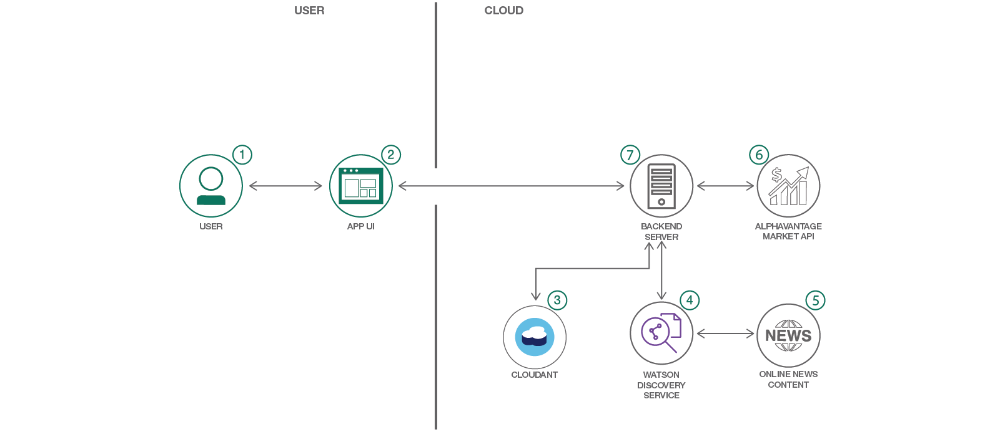
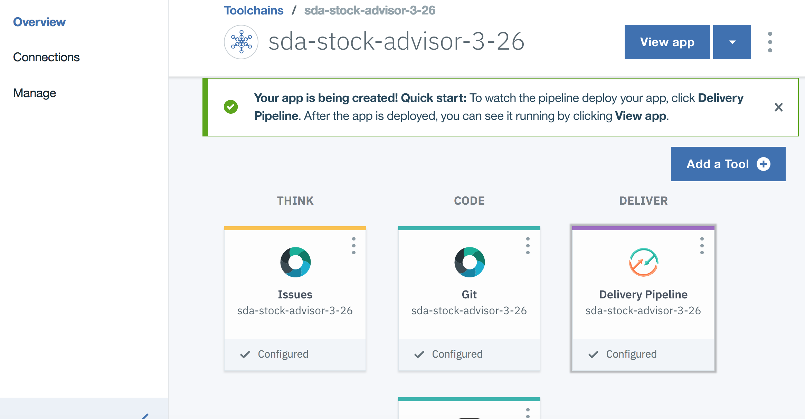
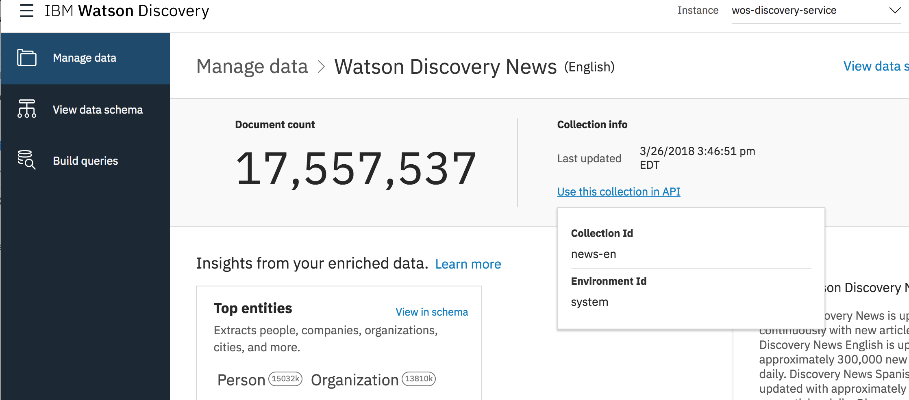
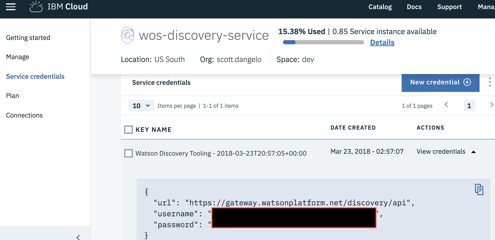
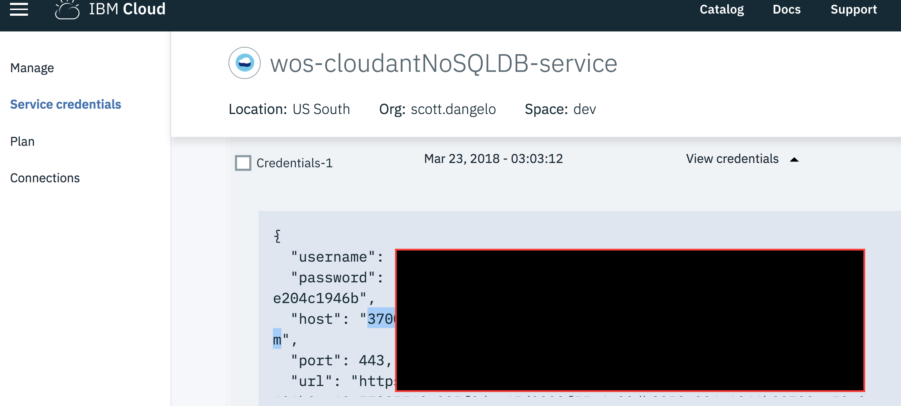
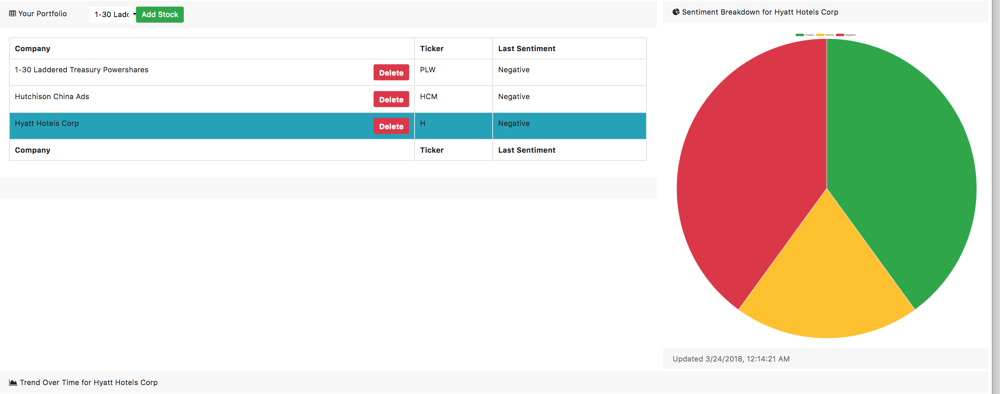
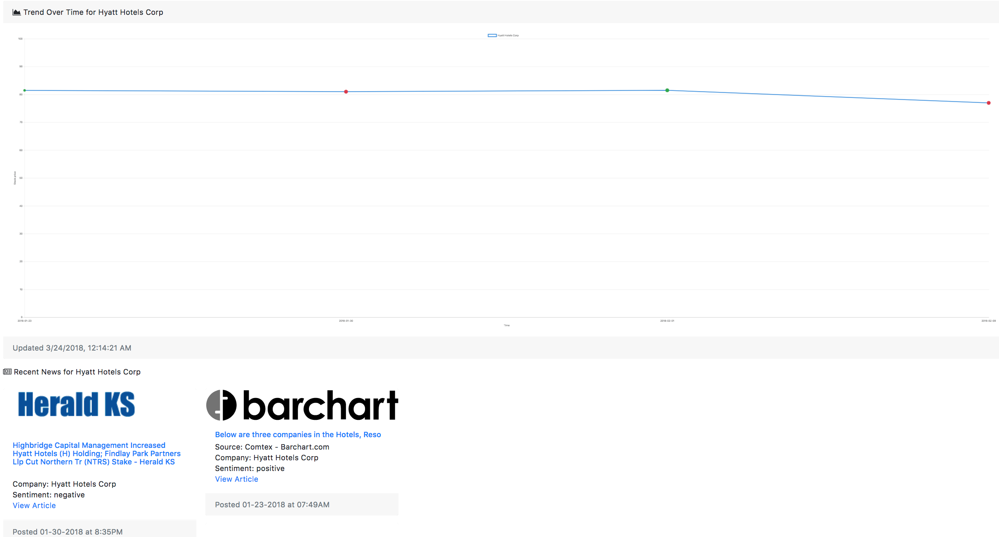

[](https://travis-ci.org/IBM/watson-stock-advisor)

*Read this in other languages: [日本語](README-ja.md).*

# Watson Stock Advisor

In this Code Pattern, we will create a web app for monitoring sentiment, price, and news for individual listed stocks, using IBM Watson Discovery and CloudantDB as well as Nodejs and Alpha Vantage.
The web page is adapted from a [template](https://startbootstrap.com/template-overviews/sb-admin/ "Start Boostrap SB Admin") from [Start Bootstrap](https://startbootstrap.com/ "Start Bootstrap") by [Blackrock Digital](https://github.com/BlackrockDigital "Blackrock Digital").
You can find the repository for the template [here](https://github.com/BlackrockDigital/startbootstrap-sb-admin "SB Admin Repo"), including its [License](https://github.com/BlackrockDigital/startbootstrap-sb-admin/blob/master/LICENSE "SB Admin License").

When the reader has completed this Code Pattern, they will understand how to:

* Create and use Watson Discovery and Cloudant NoSQL Database
* Gather news from the Watson Discovery News service
* Obtain stock price information from Alpha Vantage
* Deploy a Nodejs application to input stock choices and display information

<p align="center">
  
</p>

## Flow

1. The user adds and remove stocks they are interested in using the Web UI.
2. User input is processed and routed to the backend server.
3. The backend server stores stock information in a Cloudant NoSQL database for easy retrieval.
4. The backend server uses Watson Discovery to find information about a specific company.
5. The Watson Discovery Service queries the Watson News collection for articles related to the company.
6. The Alpha Vantage APIs are queried to find market price for a given company.
7. News, sentiment, and stock price are all returned and rendered in the web app to the user.

## Included Components

* [Watson Discovery](https://www.ibm.com/watson/developercloud/discovery.html): A cognitive search and content analytics engine for applications to identify patterns, trends, and actionable insights.
* [Cloudant NoSQL DB](https://cloud.ibm.com/catalog/services/cloudant): A fully managed data layer designed for modern web and mobile applications that leverages a flexible JSON schema.

## Featured Technologies

* [NodeJS](https://nodejs.org/en/): Node.js® is a JavaScript runtime built on Chrome's V8 JavaScript engine. Node.js uses an event-driven, non-blocking I/O model that makes it lightweight and efficient. Node.js' package ecosystem, npm, is the largest ecosystem of open source libraries in the world.

# Watch the Video

[](https://youtu.be/uigisF50F8s)

# Prerequisites

### Create an Alpha Vantage account and get API key

* Create an account on [Alpha Vantage](https://www.alphavantage.co/) by clicking `Get Your Free API Key Today`.
* Copy the Alpha Vantage API key for later use

# Steps

Use the ``Deploy to IBM Cloud`` button **OR** create the services and run locally.

## Deploy to IBM Cloud

[](https://cloud.ibm.com/devops/setup/deploy?repository=https://github.com/IBM/watson-stock-advisor)

1. Press the above ``Deploy to IBM Cloud`` button and then click on ``Deploy``.

<!--optional step-->
2. In Toolchains, click on ``Delivery Pipeline`` to watch while the app is deployed. (Note, if you get an 
error on the first time you deploy such as `Server error, status code: 409, error code: 60016, message: An operation for service instance wsa-discovery is in progress.`, just click on the re-deploy button again, and it should work).
 Once deployed, the app can be viewed by clicking ``View app``.

<p align="center">
  
</p>

<!--update with service names from manifest.yml-->
3. To see the app and services created and configured for this Code Pattern, use the IBM Cloud dashboard. The app is named `watsonstockadvisor` with a unique suffix. The following services are created and easily identified by the `wsa-` prefix:
    * wsa-discovery
    * wsa-cloudant

You can Deploy the application simply by clicking the ``Deploy to IBM Cloud`` button above to automatically create a toolchain to provision and run the application.

If you do not have an IBM Cloud account yet, you will need to create one.

### Update the Environment of your deployed app

1. Navigate to https://cloud.ibm.com/dashboard/apps/
2. Located and click on your newly created application (not the 'Route' link)
3. Select 'Runtime' in the left menu
4. Select the 'Environment Variables' tab in the middle of the page
5. Scroll down to the User defined variables section
6. Paste your API key from [Alpha Vantage](https://www.alphavantage.co/)

## Run locally

1. [Clone the repo](#1-clone-the-repo)
2. [Create IBM Cloud services](#2-create-ibm-cloud-services)
3. [Configure Watson Discovery and Get Credentials](#3-configure-watson-discovery-and-get-credentials)
4. [Provision Cloudant NoSQL DB and Get Credentials](#4-provision-cloudant-nosql-db-and-get-credentials)
5. [Web Portal](#5-web-portal)
6. [Add IBM Cloud Services Credentials to .env file](#6-add-ibm-cloud-services-credentials-to-env-file)
7. [Run the application](#7-run-the-application)

### 1. Clone the repo

Clone the `watson-stock-advisor` locally. In a terminal, run:

```
$ git clone https://github.com/ibm/watson-stock-advisor
```

### 2. Create IBM Cloud services

Create the following services:

  * [**Watson Discovery**](https://cloud.ibm.com/catalog/services/discovery)
  * [**Cloudant NoSQL DB**](https://cloud.ibm.com/catalog/services/cloudant)


### 3. Configure Watson Discovery and get credentials

* Launch the **Watson Discovery** tool. The first time you do this, you will see
"Before working with private data, we will need to set up your storage". Click ``Continue`` and wait for the storage to be set up.

* Choose `Watson Discovery News` from the `Manage Data` tab.

* Under  `Collection Info` section, click `Use this collection in API` and copy the `Environment ID` into your .env file as `DISCOVERY_ENV_ID`. This should be `system` for the `Watson Discovery News` collection.

<p align="center">
  
</p>

* From the top-level Discovery page, click `Service Credentials`. If there is no credential under `View Credentials` click `New Credential` and then `View Credentials`.

<p align="center">
  
</p>

* Use the `username` and `password` in the .env file, as instructed below.

### 4. Provision Cloudant NoSQL DB and Get Credentials

* Navigate to cloud.ibm.com
* Click ``Create Resource``
* Search for ``cloudant nosql``
* Select the only search result under ``Data & Analytics`` called ``Cloudant NoSQL DB``
* Specify the settings you want
* Click ``Create`` in the bottom right

* From the top-level Cloudant page, click `Service Credentials`. If there is no credential under `View Credentials` click `New Credential` and then `View Credentials`.

<p align="center">
  
</p>

### 5. Web Portal

The web page is adapted from a [template](https://startbootstrap.com/template-overviews/sb-admin/ "Start Boostrap SB Admin") from [Start Bootstrap](https://startbootstrap.com/ "Start Bootstrap") by [Blackrock Digital](https://github.com/BlackrockDigital "Blackrock Digital").
You can find the repository for the template [here](https://github.com/BlackrockDigital/startbootstrap-sb-admin "SB Admin Repo"), including its [License](https://github.com/BlackrockDigital/startbootstrap-sb-admin/blob/master/LICENSE "SB Admin License").


### 6. Add IBM Cloud Services Credentials to .env file

As you create the Bluemix Services, you'll need to create service credentials and get the
username and password:

Move the ``watson-stock-advisor/web/env.sample`` file to ``watson-stock-advisor/web/.env`` and populate the service
credentials (and Cloudant URL) as you create the credentials:

The credentials for IBM Cloud services (Discovery), can be found in the ``Services`` menu in IBM Cloud,
by selecting the ``Service Credentials`` option for each service.

The other settings for Discovery were collected during the
earlier setup steps (``ENV_ID``).

Navigate to the web directory and Copy the [`env.sample`](env.sample) to `.env`.

```
$ cp env.sample .env
```

Edit the `.env` file with the necessary settings.

#### `env.sample:`

```
# Copy this file to .env and replace the credentials with 
# your own before starting the app.

# Watson Discovery
DISCOVERY_VERSION_DATE="2018-03-05"
DISCOVERY_ENV_ID="system"
DISCOVERY_URL=<add_discovery_url>
## Un-comment and use either username+password or IAM apikey.
# DISCOVERY_USERNAME=<add_discovery_username>
# DISCOVERY_PASSWORD=<add_discovery_password>
# DISCOVERY_IAM_APIKEY=<add_discovery_iam_apikey>

# Cloudant
CLOUDANT_USERNAME=<add_cloudant_username>
CLOUDANT_PASSWORD=<add_cloudant_password>
CLOUDANT_HOST=<add_cloudant_host>
DB_NAME="stock-data"

# App Config
MAX_COMPANIES=20
MAX_ARTICLES_PER_COMPANY=100

# AlphaVantage
ALPHAVANTAGE_API_KEY="demo"
```

### 7. Run the application

#### If you decided to run the app locally...

In the root directory, run:

```
$ npm install
$ npm start
```

The portal should now be accessible on port ``8080`` (or another port specified by PORT in .env)

# Sample Output

<p align="center">
  
  
</p>

## Links

* [Watson Discovery](https://www.ibm.com/watson/services/discovery/)
* [IBM Cloudant db](https://www.ibm.com/cloud/cloudant)
* [Youtube Video](https://www.youtube.com/watch?v=uigisF50F8s)

## Learn more

* **Artificial Intelligence Code Patterns**: Enjoyed this Code Pattern? Check out our other [AI Code Patterns](https://developer.ibm.com/technologies/artificial-intelligence/).
* **AI and Data Code Pattern Playlist**: Bookmark our [playlist](https://www.youtube.com/playlist?list=PLzUbsvIyrNfknNewObx5N7uGZ5FKH0Fde) with all of our Code Pattern videos
* **With Watson**: Want to take your Watson app to the next level? Looking to utilize Watson Brand assets? [Join the With Watson program](https://www.ibm.com/watson/with-watson/) to leverage exclusive brand, marketing, and tech resources to amplify and accelerate your Watson embedded commercial solution.

## License

This code pattern is licensed under the Apache Software License, Version 2.  Separate third party code objects invoked within this code pattern are licensed by their respective providers pursuant to their own separate licenses. Contributions are subject to the [Developer Certificate of Origin, Version 1.1 (DCO)](https://developercertificate.org/) and the [Apache Software License, Version 2](https://www.apache.org/licenses/LICENSE-2.0.txt).

[Apache Software License (ASL) FAQ](https://www.apache.org/foundation/license-faq.html#WhatDoesItMEAN)
